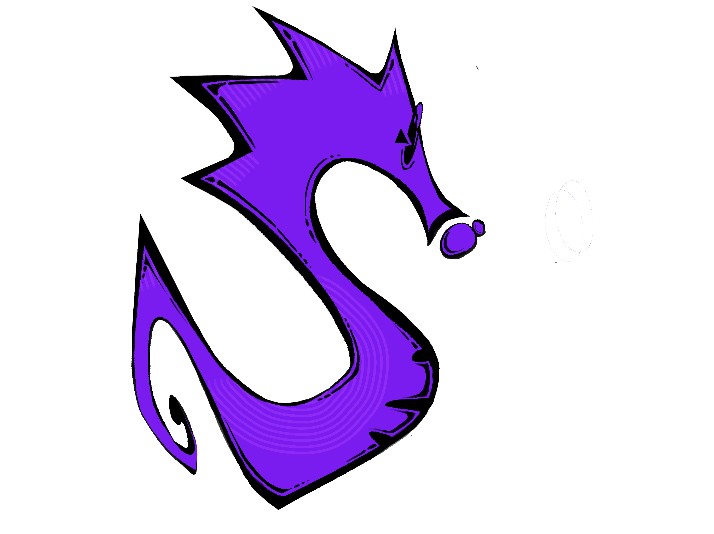
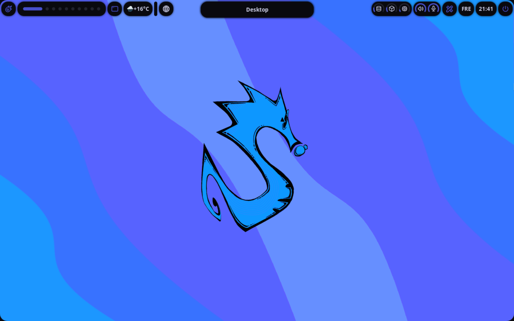
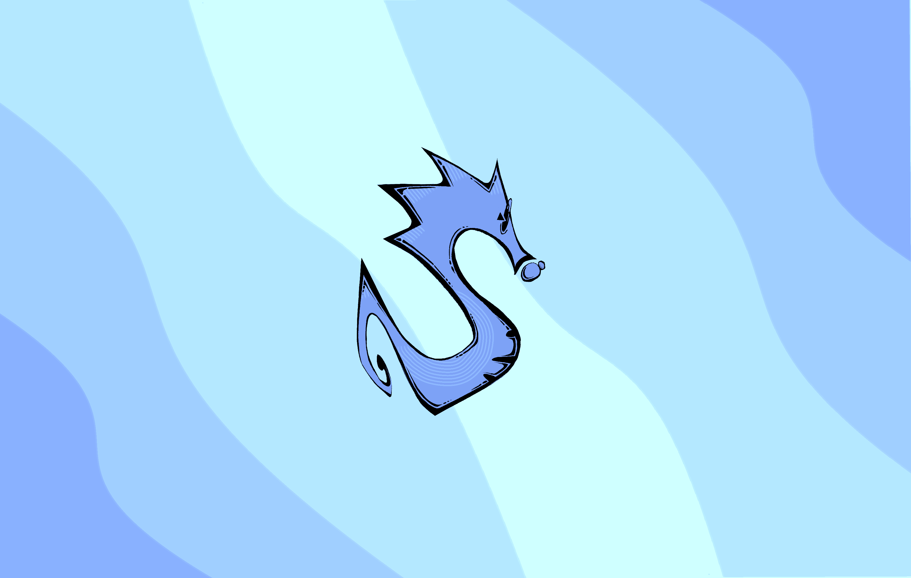
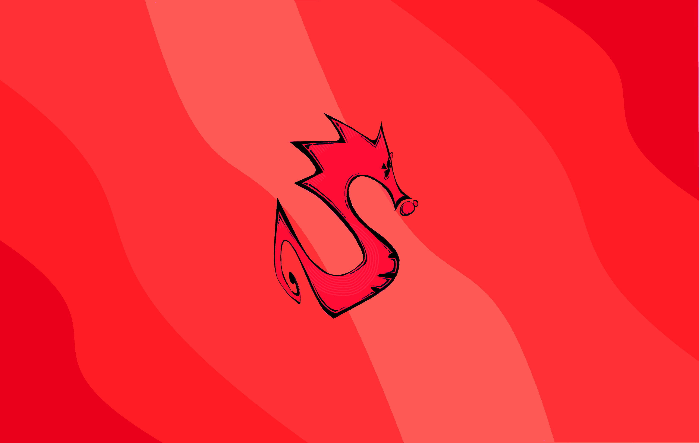
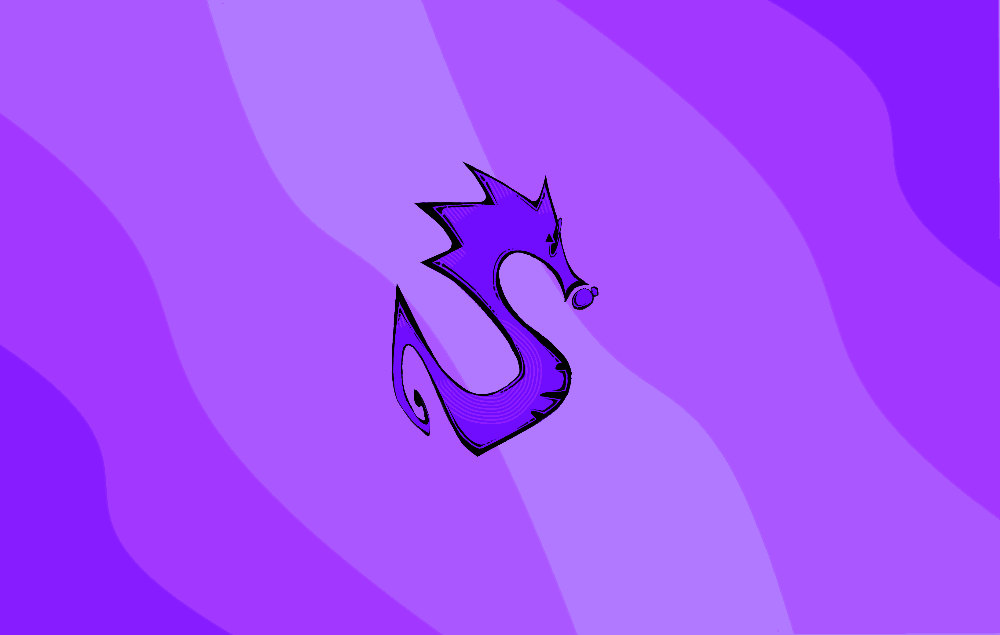
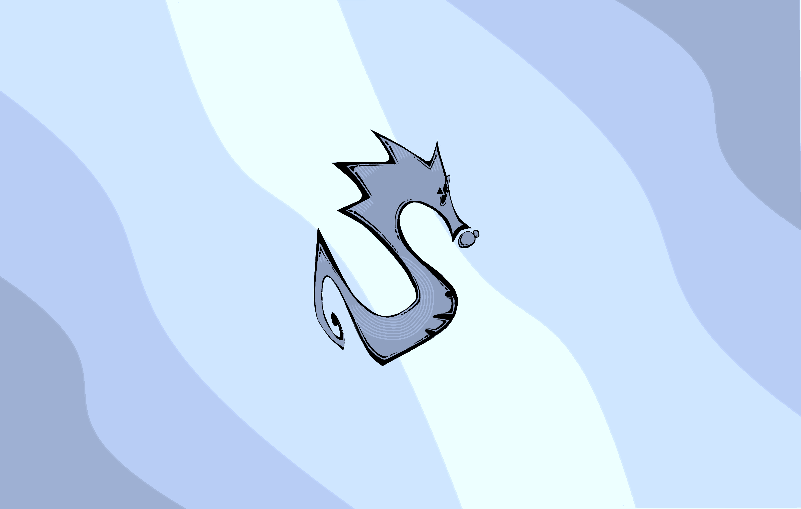
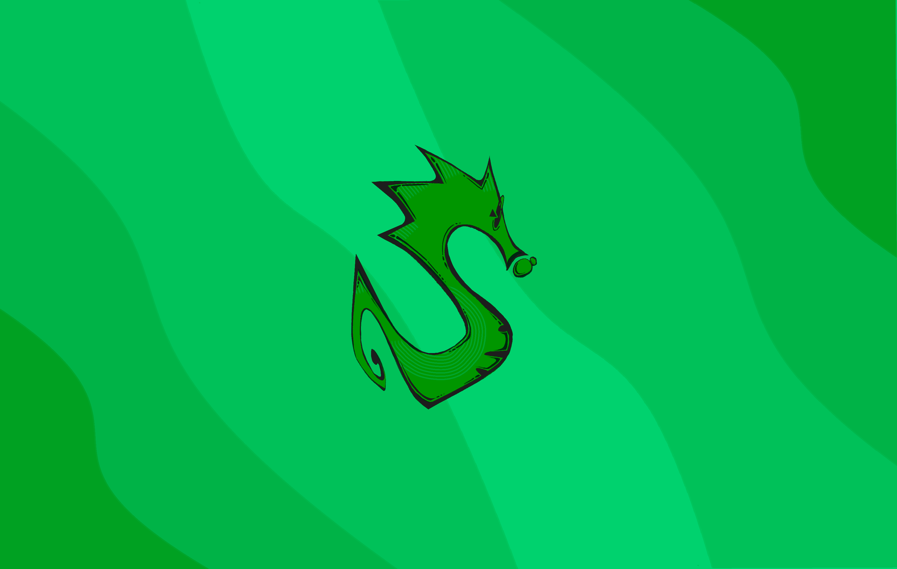
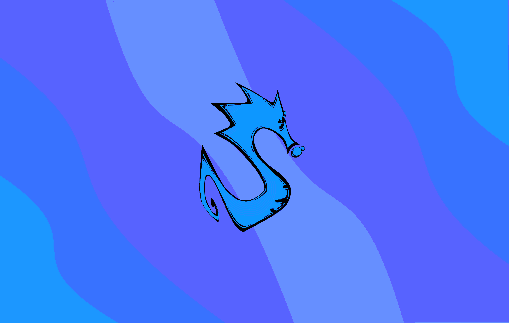
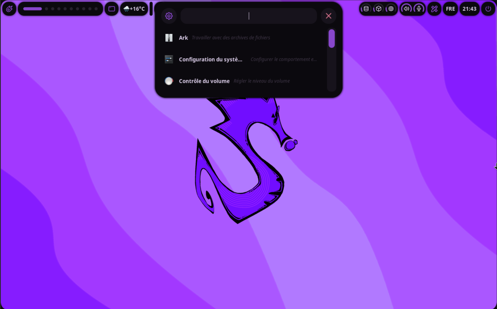
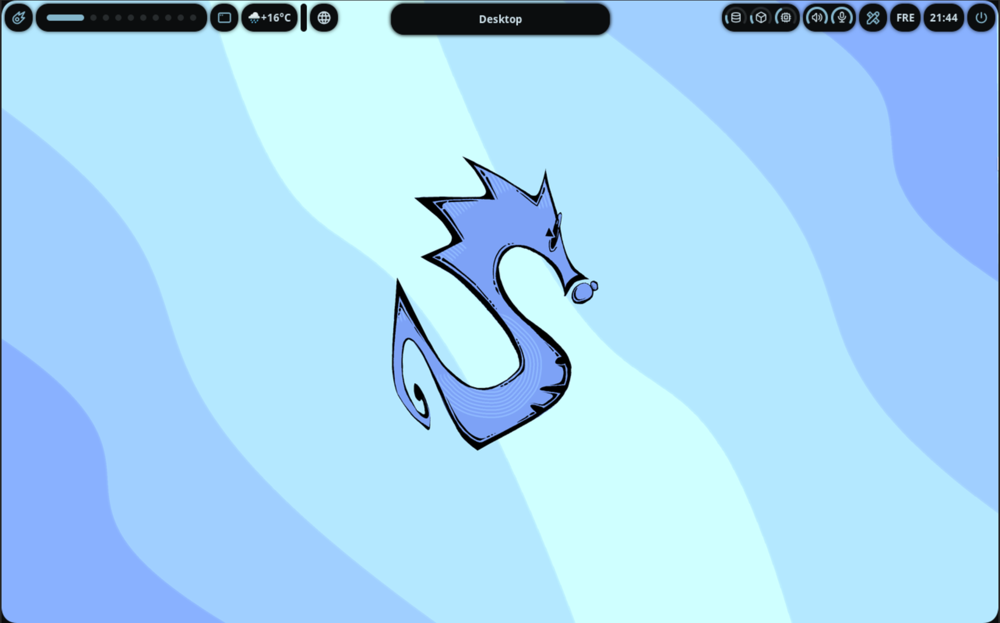

<div align="center">



# SyndraShell

**Un environnement de bureau Hyprland orienté cybersécurité.**

Interface Wayland épurée · thème qui suit le fond d'écran · outils de sécurité conteneurisés par profil.

<a href="https://discord.gg/pbrrd5ATK5">Discord</a> · <a href="https://ko-fi.com/syndrashell">Support</a>

<br/>



</div>

<br/>

## Aperçu

SyndraShell est un shell de bureau pour **Hyprland**, écrit avec le framework **Fabric** (Python / GTK3). Il réunit une interface soignée et un toolkit de sécurité isolé en conteneurs, organisé en profils opérationnels.

- L'interface (barre, dashboard, dynamic island, dock, notifications) tourne sur l'hôte.
- Les outils offensifs et défensifs tournent dans **Docker**, isolés du système.
- Les couleurs de l'interface sont **dérivées automatiquement du fond d'écran**.
- Chaque profil possède son thème, son fond d'écran et sa sélection d'outils.

<br/>

## Installation

> Requis : **Arch Linux**, une session **Hyprland**, `git` et `curl`. Docker est installé automatiquement.

```bash
bash <(curl -sL https://raw.githubusercontent.com/Fud0o0/Syndra/main/install.sh) <profil>
```

```bash
# exemples
bash <(curl -sL https://raw.githubusercontent.com/Fud0o0/Syndra/main/install.sh) blue-team
bash <(curl -sL https://raw.githubusercontent.com/Fud0o0/Syndra/main/install.sh) red-team
bash <(curl -sL https://raw.githubusercontent.com/Fud0o0/Syndra/main/install.sh) purple
bash <(curl -sL https://raw.githubusercontent.com/Fud0o0/Syndra/main/install.sh) root-me
bash <(curl -sL https://raw.githubusercontent.com/Fud0o0/Syndra/main/install.sh) custom
bash <(curl -sL https://raw.githubusercontent.com/Fud0o0/Syndra/main/install.sh) default
```

L'installateur vérifie chaque dépendance, installe Hyprland et la stack Wayland, configure le profil, télécharge les images Docker, puis met l'interface en démarrage automatique. À la fin, sélectionne la session **Hyprland** à la connexion.

<br/>

## Profils

Le profil est choisi à l'installation : il détermine le thème, le fond d'écran et les outils. Pour en changer, réinstalle avec un autre profil.

| Profil | Orientation | Espace conseillé |
| :-- | :-- | :-- |
| `blue-team` | Défense, détection, analyse réseau | 6 Go |
| `red-team` | Pentest, exploitation | 7 Go |
| `purple` | Couverture complète Red + Blue | 10 Go |
| `root-me` | CTF, reverse, forensics | 7 Go |
| `custom` | Outils choisis à la carte | 4 Go + |
| `default` | Base minimale | 4 Go |

<div align="center">
<table>
  <tr>
    <td align="center"><br/><b>Blue Team</b></td>
    <td align="center"><br/><b>Red Team</b></td>
    <td align="center"><br/><b>Purple</b></td>
  </tr>
  <tr>
    <td align="center"><br/><b>Root-Me</b></td>
    <td align="center"><br/><b>Custom</b></td>
    <td align="center"><br/><b>Default</b></td>
  </tr>
</table>
</div>

<br/>

## Outils conteneurisés

Tous les outils tournent dans Docker, pilotés par le lanceur `syndra-tools`. Les fichiers sont partagés via `~/syndra-workspace` ↔ `/workspace`.

```bash
syndra-tools                 # outils du profil actif
syndra-tools catalog         # catalogue complet (36 outils)
syndra-tools <outil>         # installe l'outil et ouvre un shell prêt
syndra-tools <outil> [args]  # exécution unique (scriptable)
syndra-tools shell           # boîte à outils Kali complète
syndra-tools pull            # (re)télécharge les images du profil
syndra-tools customize       # profil custom : choisir ses outils
syndra-tools update          # mise à jour de Syndra
```

```bash
# exemples
syndra-tools nmap -sV 10.0.0.1
syndra-tools john
syndra-tools shell
```

**Sélection par profil**

- **blue-team** — nmap, tshark, tcpdump, wireshark, suricata, zeek, clamav, trivy, grype, lynis, nuclei
- **red-team** — kali, nmap, rustscan, metasploit, nikto, sqlmap, gobuster, ffuf, feroxbuster, wpscan, nuclei, whatweb, hydra, john, hashcat
- **purple** — Red + Blue réunis (metasploit, wireshark, suricata, sqlmap, hashcat, zap…)
- **root-me** — kali, nmap, radare2, gdb, ghidra, binwalk, steghide, exiftool, foremost, volatility3, john, hashcat, sqlmap, hydra
- **custom** — à la carte parmi les 36 outils du catalogue

<br/>

## Thème dynamique

L'interface extrait la couleur dominante du fond d'écran courant et en génère toute la palette. Change de fond — l'interface se recolore automatiquement. Chaque profil installe son fond assorti ; un sélecteur est intégré au dashboard (onglet Wallpapers).

<div align="center">
<table>
  <tr>
    <td align="center"><br/><sub>Lanceur d'applications</sub></td>
    <td align="center"><br/><sub>Profil Root-Me</sub></td>
  </tr>
</table>
</div>

<br/>

## Raccourcis

| Raccourci | Action |
| :-- | :-- |
| `SUPER` + `Entrée` / `R` | Terminal (Kitty) |
| `SUPER` + `D` | Lanceur d'applications |
| `SUPER` + `B` | Navigateur |
| `SUPER` + `E` | Explorateur de fichiers |
| `SUPER` + `L` | Verrouiller la session |
| `SUPER` + `F` | Plein écran |
| `SUPER` + `Espace` | Basculer flottant |
| `SUPER` + `Q` / `C` | Fermer la fenêtre |
| `SUPER` + `Shift` + `M` | Quitter Hyprland |
| `SUPER` + `Shift` + `R` | Redémarrer l'interface |
| `SUPER` + `Ctrl` + `R` | Recharger Hyprland |
| `SUPER` + `1`–`0` | Aller au workspace |
| `SUPER` + `Shift` + `1`–`0` | Envoyer la fenêtre au workspace |
| `Print` / `SUPER` + `Shift` + `S` | Capture d'écran |
| Touches `XF86` | Volume · Luminosité · Média |

Le dashboard, le launcher et la dynamic island sont aussi accessibles depuis la barre.

<br/>

## Commande `syndra`

Une commande unique pour piloter le shell :

```bash
syndra              # bannière + aide
syndra update       # met à jour Syndra (git + lanceurs)
syndra restart      # redémarre l'interface
syndra reload       # recharge la configuration Hyprland
syndra lock         # verrouille la session
syndra status       # état (profil, interface, docker, fond d'écran)
syndra tools [...]  # raccourci vers syndra-tools
syndra version      # commit installé
```

<br/>

## Maintenance

```bash
# Mise à jour
syndra update

# Désinstallation (conserve Hyprland et les wallpapers perso)
bash <(curl -sL https://raw.githubusercontent.com/Fud0o0/Syndra/main/uninstall.sh)

# Désinstallation complète (Hyprland + images Docker Syndra)
bash <(curl -sL https://raw.githubusercontent.com/Fud0o0/Syndra/main/uninstall.sh) --full
```

<br/>

## Structure

```
SyndraShell/
├── main.py                  point d'entrée de l'interface
├── syndrashell.sh           script de démarrage (lancé par Hyprland)
├── install.sh / uninstall.sh
├── config/
│   ├── themes.py            palettes par profil
│   ├── wallpaper_theme.py   couleurs dérivées du fond d'écran
│   └── hypr/hyprland.conf
├── modules/                 widgets (bar, notch, dashboard, dock…)
├── styles/                  feuilles de style de l'interface
├── assets/
│   ├── wallpapers/          fonds d'écran par profil
│   └── fonts/               police tabler-icons
├── containers/              docker-compose par profil
└── scripts/
    ├── syndra-tools.sh      lanceur d'outils conteneurisés
    └── install/             installation d'outils par profil
```

<br/>

## Stack

Hyprland (Wayland) · Fabric (UI Python/GTK3) · awww (fond d'écran) · Docker (isolation des outils) · Pillow (extraction des couleurs).

<br/>

<div align="center">
<sub>Construit avec Fabric · Destiné à un usage en environnement autorisé uniquement.</sub>
</div>
